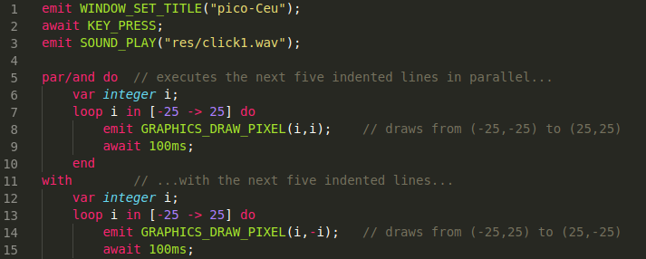

# Céu for Visual Studio Code

This extension adds syntax highlighting suport for the [Céu language](http://ceu-lang.org) to VS Code.



## Instalation
Move the content of this repository to ```~/.vscode/extensions/ceu``` folder.

## Known Issues

- [Céu nested comments](https://ceu-lang.github.io/ceu/out/manual/v0.30/lexical_rules/comments/) are not fully supported. This language extension will highlight up to three nested comment blocks. We're looking for a way to support highlight for this feature.

- No highlight for C nested code ([check C integration at Céu documentation](https://ceu-lang.github.io/ceu/out/manual/v0.30/statements/c_integration/)).

-----------------------------------------------------------------------------------------------------------

## Release Notes

Users appreciate release notes as you update your extension.

### 0.1

Initial release of the syntax highlight.